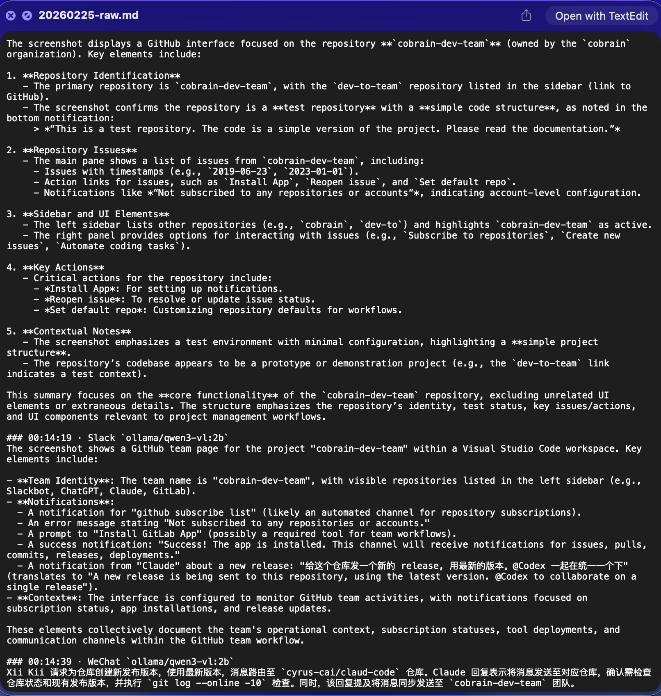

# claude-cobrain

**English** | [简体中文](./README_zh.md)

> ⚠️ **Note**: This project is currently in the **preview stage**. Features may be unstable, and there might be breaking changes in future updates.

claude-cobrain is a Claude Code plugin that gives Claude persistent memory of your workflow by continuously summarizing on-screen activity.

**Our North Star metrics:**

- Claude generates weekly and monthly work summaries with **95%+ accuracy**
- Claude surfaces constructive suggestions that have **measurable economic value**


[Learn more about goals and philosophy](https://claude-cobrain-web.vercel.app/)


## Privacy

- Local-only processing: screenshots are analyzed by a local backend (`ollama` or `fastvlm`).
- Local storage: summaries and logs are written to `~/.claude/cobrain` by default (configurable via `OUTPUT_DIR`).
- User control: you can stop or remove the daemon at any time with `/claude-cobrain:cobrain stop` and `/claude-cobrain:cobrain uninstall`.


## Get started

Installation
> Currently for macOS only.

Step 1 - Add the marketplace (first time only):

```shell
/plugin marketplace add cyrus-cai/claude-cobrain
```

Step 2 - Install the plugin:

```shell
/plugin install claude-cobrain
```

Step 3 - Set up the daemon:

```shell
/claude-cobrain:cobrain install
```

Then, the memory daemon will start automatically and generates markdown file in `~/.claude/cobrain/`.
> Example:
> { width=600px }


System Requirements

| Component         | Requirement                     | Purpose                                      |
| ----------------- | ------------------------------- | -------------------------------------------- |
| Operating System  | macOS                           | LaunchAgent support, Accessibility API       |
| Python            | 3.11                            | Runtime for daemon script                    |
| Ollama            | Latest version                  | Local LLM inference service                  |
| Model             | qwen3-vl:2b                     | Vision Language Model (2 billion parameters) |
| Python Packages   | Pillow, ollama                  | Image processing, API client                 |
| Disk Space        | ~2GB for model + logs           | Model storage and daily summaries            |
| macOS Permissions | Accessibility, Screen Recording | Window detection, screenshot capture         |


## Core Workflow

- captures screenshots of the frontmost window
- processes them through a local VLM
- appends timestamped summaries to markdown files


## License

This project is licensed under the MIT License - see the [LICENSE](LICENSE) file for details.
