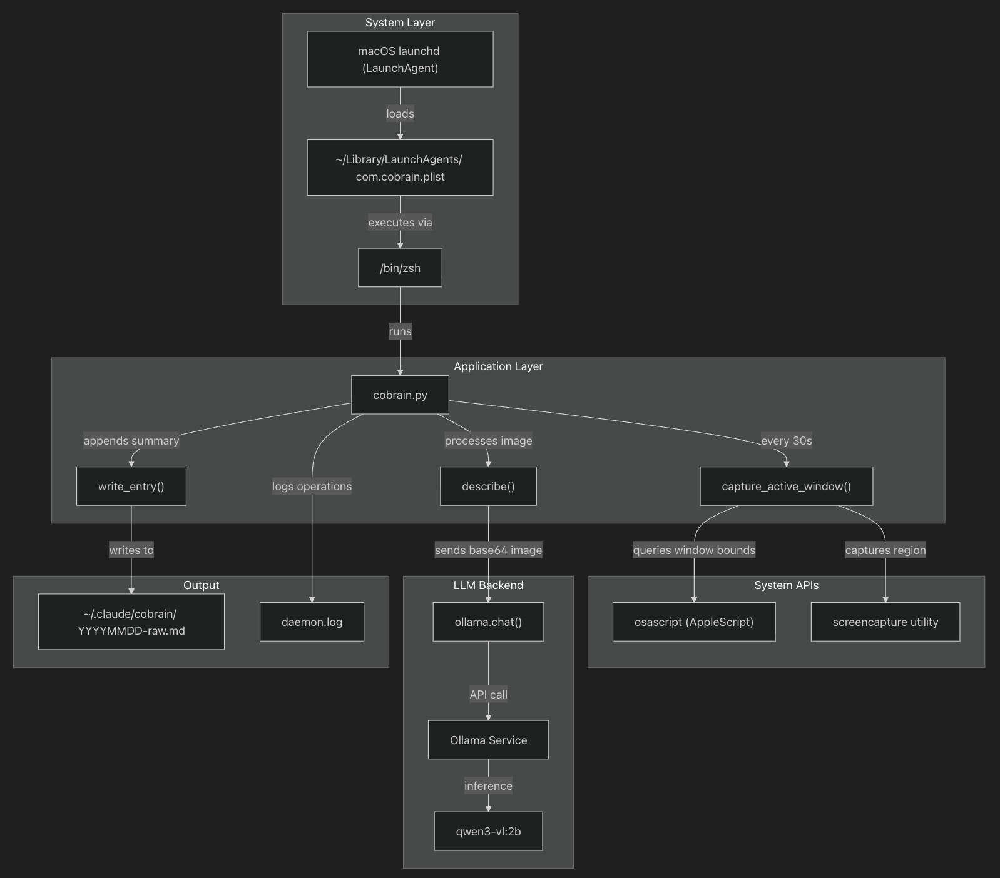

# claude-cobrain

[English](README.md) | **简体中文**

## 如果 AI 和你拥有相同的上下文

Claude 等模型在特定任务（如编码上）已经表现得十分出色。本项目试图通过持续记录屏幕活动，赋予模型对于整个工作流的持久记忆。

**3 North Star Metrics:**

- Claude 生成的周/月工作总结具有95% 以上的可用性
- Claude 能够提出具有可衡量经济价值的建设性建议
- Claude 可以提出新的营利路径， 在个人维度创造翻倍的收入

---

### claude-cobrain 是做什么的？

claude-cobrain 是一个 macOS 后台守护进程，它会持续监控你的活动窗口，并使用自然语言生成关于你正在处理的工作的摘要。它会：

- 截取活动窗口
- 通过本地的 VLM 处理截图
- 摘要并以 markdown 文件形式保存

### 安装

将以下命令粘贴到 **Claude Code**：

```shell
clone https://github.com/cyrus-cai/claude-cobrain and run SKILL.md until cobrain is running
```

当前仅支持 macOS。

### 系统架构




### 系统要求

| 组件       | 要求               | 目的                                |
| ---------- | ------------------ | ----------------------------------- |
| 操作系统   | macOS              | 支持 LaunchAgent，Accessibility API |
| Python     | 3.11               | 运行环境                            |
| Ollama     | 最新版本           | 本地 LLM 推理服务                   |
| 模型       | qwen3-vl:2b        | 视觉语言模型（2B）                  |
| Python 包  | Pillow, ollama     | 图像处理，API 客户端                |
| 磁盘空间   | ~2GB               | 模型和 .md 摘要                     |
| macOS 权限 | 辅助功能、屏幕录制 | 窗口检测、屏幕截图                  |

## License

This project is licensed under the MIT License - see the [LICENSE](LICENSE) file for details.